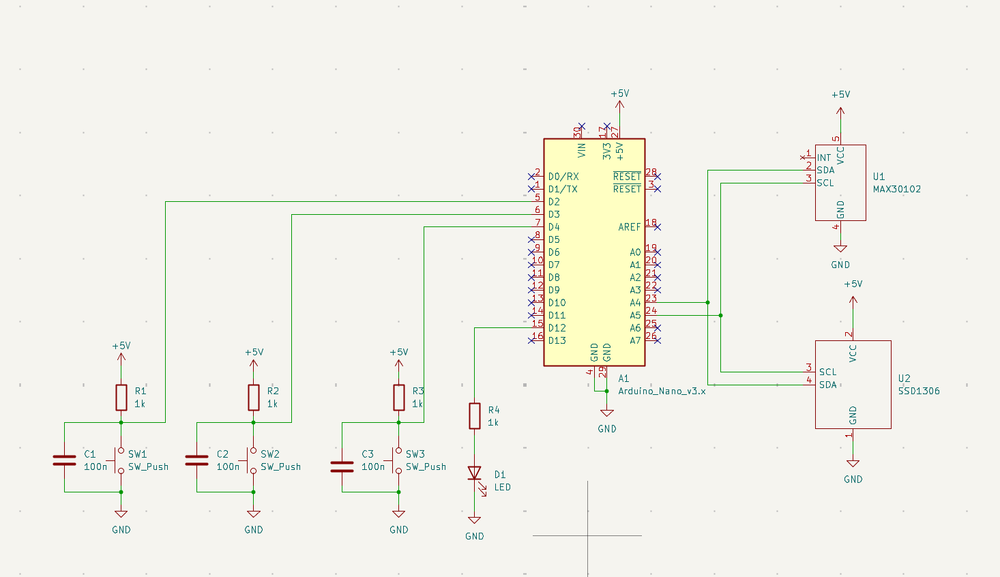

# Embedded-Heart-Rate-Monitoring-System-with-OLED-Display
Arduino Nano heart rate monitor that reads pulse data from MAX30102 and displays on the SSD1306 OLED.

Both the sensor and the display communicate with the Arduino through the I²C interface, keeping the wiring simple and compact.

The goal of this project was to design a small embedded system that combines biometric sensing, microcontroller processing, and real-time display output.

Hardware Used:
- Arduino Nano: Microcontroller
- MAX30102 Pulse Oximeter Sensor: Reads in heart rate and blood oxygen 
- SSD1306 OLED Display: Displays the BPM read in from the oximeter sensor 
- 1k Resistor: Limits current
- Potentiometer (Simulation): Creates sliding scale for heartrate, used in digital simulation
- LED: Blinks at the same tempo as the BPM.
- 100nF Capacitor: Filters debouncing from pushbuttons.

Wiring:

Libraries:
- Adafruit SSD1306
- Adafruit GFX Library

Setup:
- Install Arduino IDE
- Install the libraries above (Sketch → Include Library → Manage Libraries)
- Wire components per the schematic above
- Open heart_rate.ino
- Select Tools → Board → Arduino Nano
- Select the correct port under Tools → Port
- Click Upload

Simulate it here! https://wokwi.com/projects/457803730824958977
